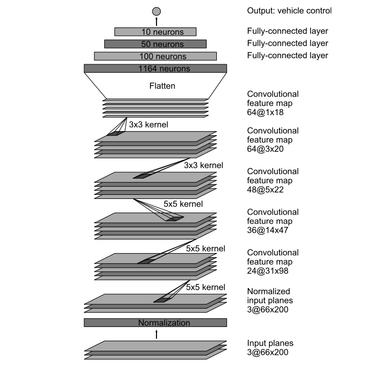

# Self Driving Car
A Tensorflow implementation of a simple self-driving car control using the image feed from a single dashcam, based on this [Nvidia Research Paper](https://arxiv.org/pdf/1604.07316.pdf) with some changes.

## Overview

Here, we use images which are frame-by-frame captures from the dashcam of a car and the ideal steering angle (the angle by which the steering is rotated by an experienced driver, in degrees) at the corresponding moments of the captures to train a Deep Neural Network to predict the momentary steering angle in a self-driving car. The output steering angles have actually been smoothened using a fine-tuned exponential smoothing operation to avoid any sudden movements or 'jerks' in the real-world actuation of the output. 

We have highly simplied the self-driving use case. There is no speed control, braking, proximity sensors or multi-camera setup. We have simply implemented the steering output from the autopilot system. 

## Data Collection

**"**Training data was collected by driving on a wide variety of roads and in a diverse set of lighting and weather conditions. Most road data was collected in central New Jersey, although highway data was also collected from Illinois, Michigan, Pennsylvania, and New York. Other road types include two-lane roads (with and without lane markings), residential roads with parked cars, tunnels, and unpaved roads. Data was collected in clear, cloudy, foggy, snowy, and rainy weather, both day and night. In some instances, the sun was low in the sky, resulting in glare reflecting from the road surface and scattering from the windshield.**"** ([Source](https://arxiv.org/pdf/1604.07316.pdf))

The dataset can be downloaded from [here](https://github.com/SullyChen/driving-datasets). 

In this implementation we have used the [training set](https://drive.google.com/file/d/1Ue4XohCOV5YXy57S_5tDfCVqzLr101M7/view?usp=sharing) with Approximately 45,500 images, 2.2GB. One of the original datasets made in 2017, the data was recorded around Rancho Palos Verdes and San Pedro California.

Data format is as follows: `filename.jpg angle`

## Network Architecture

The network consists of 9 layers, including a normalization layer, 5 convolutional layers and 3 fully connected layers. 

The convolutional layers were designed to perform feature extraction and were chosen empirically. We use strided convolutions in the first 3 convolutional layers with a 2×2 stride and a 5×5 kernel and a non-strided convolution with a 3×3 kernel size in the last 2 convolutional layers.

The fully connected layers are designed to function as a controller for steering.

### **The overall architecture of the network can be seen below :**

## Usage

Download the dataset from [here](https://drive.google.com/file/d/1Ue4XohCOV5YXy57S_5tDfCVqzLr101M7/view?usp=sharing) and extract into the [driving_dataset](driving_dataset) repository folder.

Use `python train.py` to train the model

Use `python run.py` to run the model on a live webcam feed

Use `python run_dataset.py` to run the model on the dataset

## References

* [End to End Learning for Self-Driving Cars](https://arxiv.org/pdf/1604.07316.pdf) - Nvidia
* [Comma AI GitHub Repository](https://github.com/commaai/research)
* [Udacity Self-Driving Car Dataset](https://github.com/udacity/self-driving-car/tree/master/datasets)
* [Sully Chen's Autopilot Repository](https://github.com/SullyChen/Autopilot-TensorFlow)
